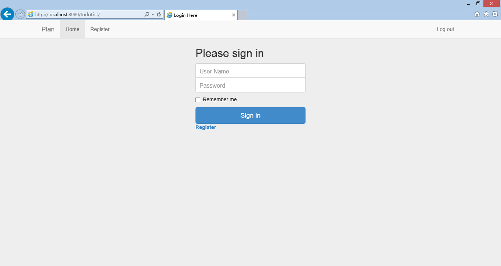
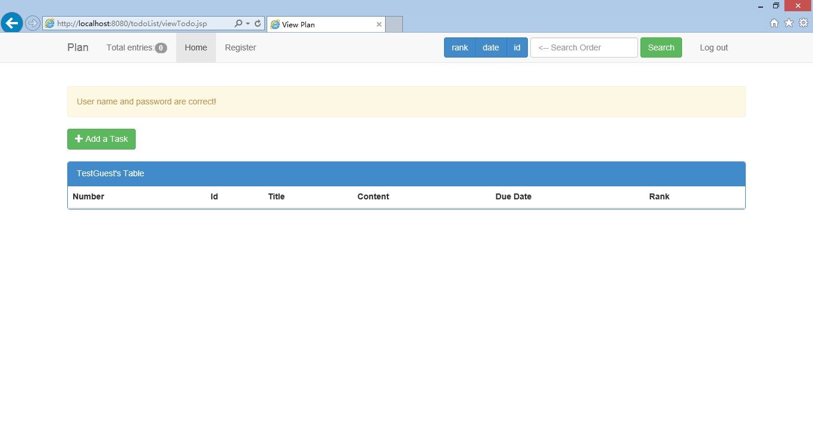
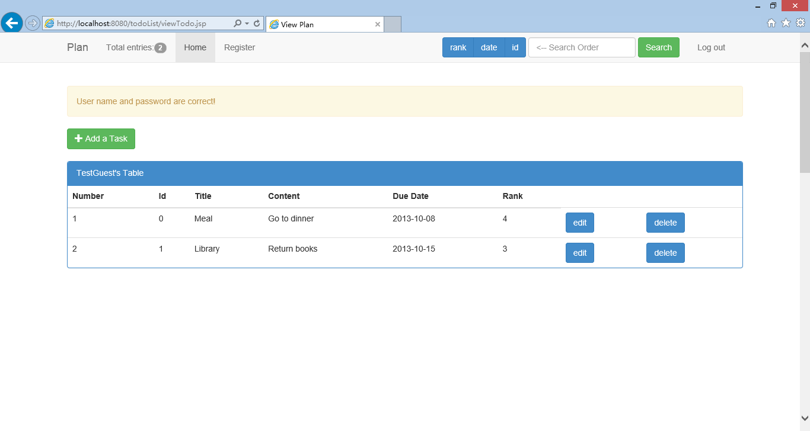
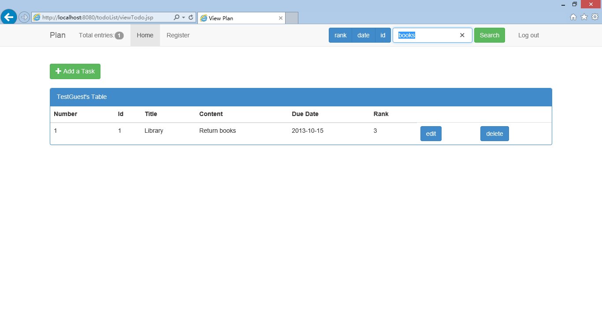
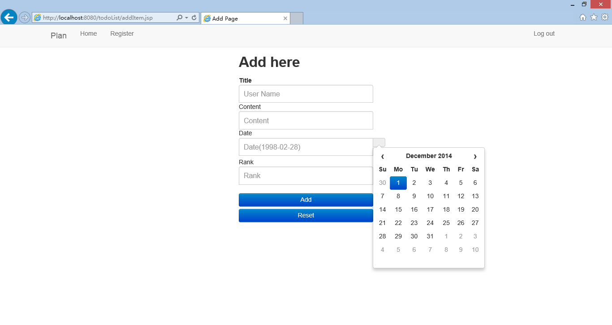

## This is the project on the IIIS summer Java course in 2013 Summer.

###Run:
>Ensure that you have the `maven` `tomcat` support;
>Just execute `mvn tomcat:run` on the root directory;
>Preview the website at `http://localhost:8080/todoList`.

###Features:
>A complete local persistent database is vailable;
>Search your todo list with what ever you want;
>Easy date selection;
>Nice fixed navigator with basic information and easy access!

###Thanks:
	The Bootstrap UI design.

###Screen shots:
	
	
	
	
	

###Have fun!